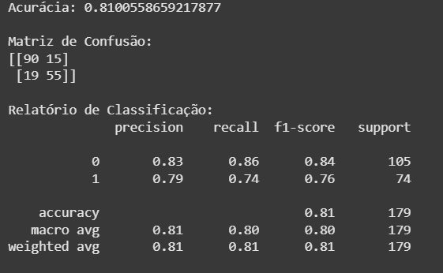

# DataScience-Demos

🚢 **Projeto Titanic – Data Science em ação**

🔍 **EDA**: explorei os dados do Titanic para entender padrões de sobrevivência.

📊 **Visualizações**: analisei distribuições de idade, sexo e classe social.

🛠 **Preparação de dados**: tratei valores ausentes e transformei variáveis categóricas.

🌲 **Modelagem**: treinei um **Random Forest Classifier** para prever sobrevivência.

✅ **Resultados**: o modelo alcançou **81% de acurácia** no conjunto de teste.

🧪 **Qualidade**: validei o notebook com **pytest + nbval**, garantindo que todas as células rodam sem erros e os resultados se mantêm consistentes.

Um ótimo exercício para praticar o ciclo completo de um projeto de Machine Learning: **explorar → preparar → modelar → avaliar → testar**.

---

## Métricas extraídas

---

## Meu Notebook

* 🚀 [Rodar no Google Colab](https://colab.research.google.com/drive/1jH-0nJX2s9Xaev6RcoGnCo2HaEUOU0ge?usp=sharing)
* 📓 [Notebook completo no GitHub](https://github.com/pablicio/Data-science-demos/blob/main/Titanic_simple_test.ipynb)
* 📂 [Base de dados utilizada](https://raw.githubusercontent.com/pablicio/Data-science-demos/refs/heads/main/covid-eda-2.csv)

